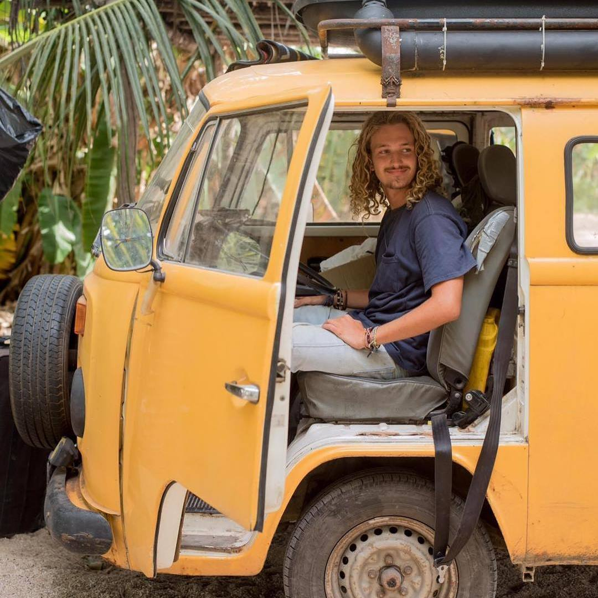

### Table of Contents:
1. [Who I am](#WIA)
2. [Ongoing Projects](#OP)
3. [My CV](https://github.com/dsenti/dsenti.github.io/blob/main/CV_Dominik_Senti.pdf)
4. [Contact](#Contact)

### Who I am <a name="WIA" />

My name is Dominik Senti and I am a swiss computer science student at [ETHZ](https://ethz.ch) (Eidgenössische Technische Hochschule Zürich). My goal in life is to leave the world a better place than I found it and I am especially fascinated by the potential of using cutting edge technology to tackle some of the biggest challenges humanity is facing such as climate change, biodiversity loss and food security. Regenerative agriculture and creating symbiotic ecosystems which involve humans as a central component is where I see some of the most promising innovations happening in the future. I have therefore decided to focus my time and energy into this intersection of the millenia-old tradition of food production and the comparatively very young field of Information Technology (Also see: [Ongoing Projects](#OP))

On a more personal level I enjoy challenges which push me out of my comfort zone and force me to adapt and evolve as a person. I find these in a multitude of ways:

I love travelling and have spent more time abroad than in Switzerland, my home country, during the last few years. I feel like languages (including programming languages) come naturally to me and I thrive in environments where communication is key. I would describe myself as an open and outgoing person who is always up for an adventure.

I enjoy parttaking in a variety of outdoor sports such as rock climbing, snowboarding (especially touring) and surfing. These have in common that you spend time in nature while having to pay respect to the forces at play in this environment. These will always be stronger than any human and nevertheless it is possible to harness the power of the natural world and use it to one's own advantage, as long as one is very mindful. I see strong parallels between these entertaning past-times and my mission of demonstrating that with enough consideration of the natural patterns we can live in a symbiotic relationship with our environment without having to resort to extreme measures.

Creativity also plays a big part in my life. I play the guitar and love to improvise or compose songs, but also appreciate immersing myself in practicing and perfecting my rendition of existing ones. I enjoy photography and filmmaking and have a [YouTube channel](https://www.youtube.com/dominiksenti). 

### Ongoing Projects <a name="OP" />
For past projects please refer to [my CV](https://github.com/dsenti/dsenti.github.io/blob/main/CV_Dominik_Senti.pdf).

The most important ongoing Project in my life at the moment is my Bachelor's degree, which I will finish by the end of 2022. I am writing my Bachelor's thesis with the [Sustainable Agroecosystems Lab](https://sae.ethz.ch/) where I will create a publicly available map of Switzerland with indicators of the resilience of the respective food systems (much like [this](https://crater.resiliencealimentaire.org/carte.html) French example). I am then looking to further develop my academic career by doing a master at ETH, probably in a related field, such as Data Science.

I am also currently on an exchange at [Hokkaido University](https://www.hokudai.ac.jp/) where I am mainly focussing on learning Japanese and broadening my horizon on a personal and cultural level.

In my free time I am currently working on making more information on climbing in Hokkaido publicly available on theCrag.com and simultaneously improving my climbing ([my theCrag profile](https://www.thecrag.com/climber/sentini)). I am also working on writing an album which however has been a very new-to-me and challenging process.

### Contact <a name="Contact">
I hope I was able to give a very brief overview of who I am and I would love to hear from you:
  
  email: dsenti@ethz.ch
